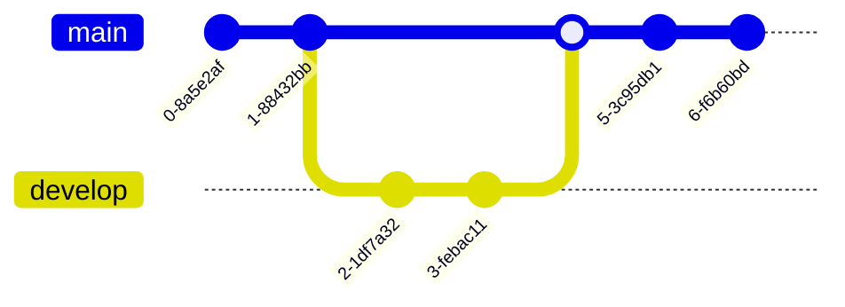

# Diagrams with Mermaid
Mermaid can be used to generate diagrams in Markdown.

## Examples

### Flowchart

### Class Diagram

### Pie Chart

### Gantt Chart

### Git Graph

---
Ressources: 
- [Live Editor](https://mermaid-js.github.io/mermaid-live-editor/edit#pako:eNpVj80OgkAMhF-l6UkTeQEOJgLKxUQTvbEcGqjsRvcnyxJjgHd30Yv21HS-mUxHbGzLmGLnyUm4FsJAnF2VS6_6oKmvIUm2U8kBtDX8miBblRZ6aZ1Tplt_-WyBIB-PC8YQpDL3-SvlH__J8ARFdSQXrKt_levTTrCv1FnG-H9Feo6uQ3Wj9EZJQx5y8h8EN6jZa1JtrD4uF4FBsmaBaVxb8neBwsyRoyHYy8s0mAY_8AYH11LgQlH8WGMMfvQ8vwGEfFP7)
- [GitHub - Include diagrams in your Markdown files with Mermaid](https://github.blog/2022-02-14-include-diagrams-markdown-files-mermaid/)
